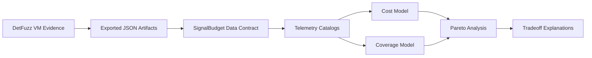

# Architecture

SignalBudget is intentionally data-coupled to DetFuzz, not code-coupled.

## Components

`contracts/detfuzz_result_schema.json`

Defines the JSON shape SignalBudget accepts from DetFuzz. The boundary is
versioned so future DetFuzz changes do not silently break SignalBudget.

`catalog/log_sources.yaml`

Defines the three v1 telemetry sources.

`catalog/detection_dependencies.yaml`

Defines which sources and fields each detection needs. Only
`d4f8c4e4-984d-4f5f-9f6c-1cc6b37f2f62` is marked
`validated_by_detfuzz`; its readable slug is
`detfuzz-v0-powershell-encoded-command`.

`catalog/investigation_questions.yaml`

Defines what analyst questions can be answered when source requirements are
present.

`measurements/source_volumes_lab_sample.yaml`

Stores 24-hour lab VM volume and byte-size measurements used for cost estimates.

`pricing/microsoft_sentinel_eastus_2026-07-23.yaml`

Stores Microsoft Sentinel pricing and freshness metadata.

`src/signalbudget/pareto.py`

Ranks complete source configurations without arbitrary weights.

`src/signalbudget/tradeoffs.py`

Generates pricing freshness, source-removal losses, and frontier narratives from
the same catalogs used by the Pareto engine.

## Boundary

SignalBudget must not import `detfuzz.*`; it consumes only exported DetFuzz JSON
and evidence files. This is enforced for `src/signalbudget/`, `tests/`, and
`integration_tests/` by `tests/test_no_detfuzz_imports.py`.

`integration_tests/` verifies the exported-evidence contract using committed
DetFuzz report and evidence fixtures, so standalone SignalBudget CI does not
need a DetFuzz checkout.
